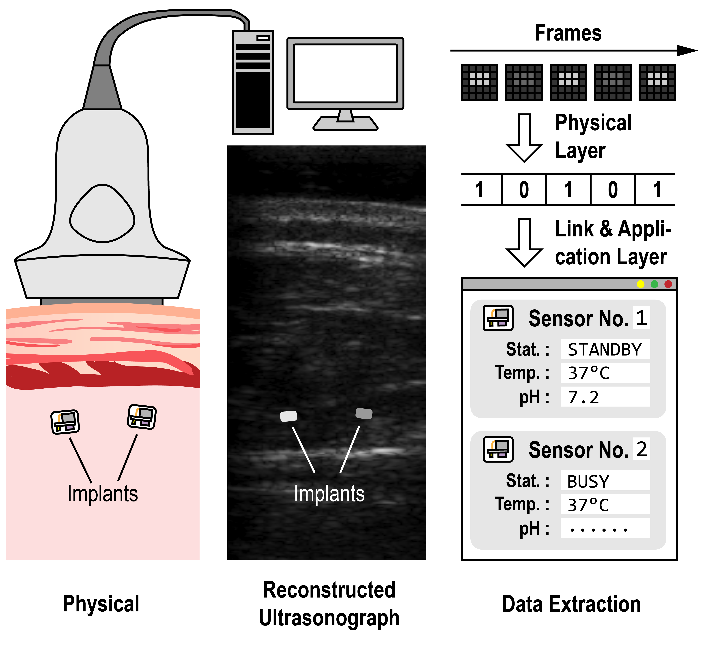
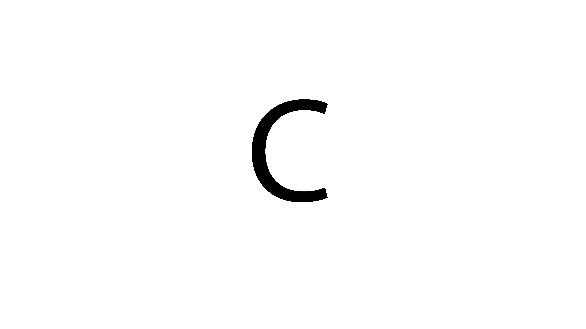

## Hardware Engineering for the Next Generation

!!!UNDER MAINTENANCE!!! - Coming up soon!
-- Revision 1

[Moore's law](http://www.computer-architecture.org/textual/Moore-Cramming-More-Components-1965.pdf) is dead.
It is dead not for the fact that transistors have stopped scaling, but because we don't have a **stable** delivery of better transistors any more.
Shrinking transistors now involves revolutionary new device structures and new materials, starting from HKMG, FinFET, to GAA in the future, each step forward is complicated with more and more uncertainties, especially if we compare them with the golden age when Dennard's scaling holds just well.
And this **lost of stability** is what I consider the death of Moore's law.

Here I devote my research effort to the "more than Moore" way, bridging integrated circuit design with new applications.
Specifically, I design low power circuits, typically in the sub-nW range, that uses energy that is previously thought unusable, to acquire information that was otherwise undetectable.
I hope my work can inspire brand new applications of how integrated circuits can be used, and transform our specific ways of living.

## Research Directions

---

<strong>Augmented Ultrasonography with Implanted CMOS Electronic Motes</strong>,
in <a href="https://www.nature.com/articles/s41467-022-31166-x"><i>Nature Communications</i></a> and <a href="https://ieeexplore.ieee.org/abstract/document/8780205"><i>2019 Custom Integrated Circuit Conference</i></a>

— Extending B-mode ultrasonography's view with sub-nW electronic implants.

**Project Highlights**
* The proposed concept is implemented with custom-designed extremely low power integrated circuits (sub-nW regime)
* Simultaneous, digital, bi-directional datalinks for multiple implants thanks to B-mode's spatial polling mechanism
* Multi-disciplinary engineering efforts including IC design, package design, image processing algorithm design, etc.
* _In vivo_ verification with mouse

<b>Ideas behind this project</b>

... to come

 

---

<strong>Sub-nW Fully Integrated pH Sensor</strong>, in <a href="https://ieeexplore.ieee.org/abstract/document/9163023"><i>2020 IEEE Symposium on VLSI Circuits</i></a>

— From a chemical signal to digital interface, all in 0.72 nW.

**Project Highlights**
- Full-stack engineering efforts from device fabrication to software design.
- 65.8 LSB/pH from on-chip pH sensing site to digital data interface.
- Easy to use with a total of 8 pins: VDD, VSS, and 6 digital signal pins.
- Designed with data acquisition software for easy, real-time pH monitoring.

More on this project

... to come

 

---

<strong>Low-Leakage, High-Speed SRAM Design</strong>, in <a href="https://ieeexplore.ieee.org/document/9731573"><i>2022 IEEE International Solid-State Circuit Conference</i></a>

— Exploring how much we can remember in the sub-nW regime.

  

	
	
	
	
  

**Project Highlights**
- Placeholder, with more to change

## Selected Publications

1. Y. You, K. Ma, R. Tian, Y. Zhang, Z. Chen, and **Y. Zhang**, "A 10-bit 15 V-Compliant Bi-Phasic Current-Mode Vagus Nerve Stimulation Circuit in 180 nm BCD Technology", to appear in _2023 International Symposium on Circuit and Systems (ISCAS)_, May. 22, 2023.

1. **Y. Zhang**, Y. You, W. Ren, X. Xu, L. Shen, J. Ru, R. Huang, and L. Ye, "A 0.954nW 32kHz Crystal Oscillator in 22nm CMOS with Gm-C-Based Current Injection Control," in _2023 IEEE International Solid-State Circuit Conference (ISSCC)_, pp. 68-69, Feb. 20, 2023

1. **Y. Zhang**, P. Muthuraman, V. Andino-Pavlovsky, I. Uguz, J. Elloian, and K. L. Shepard, "[Augmented Ultrasonography with Implanted CMOS Electronic Motes](https://www.nature.com/articles/s41467-022-31166-x)," in _Nature Communications_, **13**, 3521, 2022.

1. X. Xu, S. Ye, J. Gao, **Y. Zhang**, L. Shen, and L. Ye, "[A 32-ppm/oC 0.9-nW/kHz Relaxation Oscillator with Event-Driven Architecture and Charge Reuse Technique](https://ieeexplore.ieee.org/document/9937717/)," in _2022 International Symposium on Circuit and Systems (ISCAS)_, Jun. 1, 2022.

1. C. Xue, **Y. Zhang**, P. Chen, M. Zhu, T. Wu, M. Wu, Y. He, and L. Ye, "[Reliability-Improved Read Circuit and Self-Terminating Write Circuit for STT-MRAM in 16 nm FinFET](https://ieeexplore.ieee.org/document/9937703)", in _2022 International Symposium on Circuit and Systems (ISCAS)_, May. 31, 2022.

1. **Y. Zhang**, C. Xue, X. Wang, T. Liu, J. Gao, P. Chen, J. Liu, L. Sun, L. Shen, J. Ru, L. Ye, and R. Huang, "[Single-Mode 6T CMOS SRAM Macros with Keeper-Loading-Free Peripherals and Row-Separate Dynamic Body Bias Achieving 2.53fW/bit Leakage for AIoT Sensing Platforms](https://ieeexplore.ieee.org/document/9731573)," in _2022 IEEE International Solid-State Circuit Conference (ISSCC)_, pp. 184-186, Feb. 20, 2022

1. **Y. Zhang**, F. A. Cardoso, and K. L. Shepard, "[A 0.72 nW, 1 Sample/s Fully Integrated pH Sensor with 65.8 LSB/pH Sensitivity](https://ieeexplore.ieee.org/document/9163023)," in _2020 IEEE Symposium on VLSI Circuits_, Jun. 15, 2020

1. <u>W-C. Cornell</u>, **<u>Y. Zhang</u>**, A. Bendebury, A. J. W. Hartel, K. L. Shepard, and L. E. P. Dietrich, "[Phenazine Oxidation by a Distal Electrode Modulates Biofilm Morphogenesis](https://www.sciencedirect.com/science/article/pii/S2590207520300071)," in _Biofilm_, vol. 2, May. 2020 (co-first author)

1. C. Shi, T. Costa, J. Elloian, **Y. Zhang**, K. L. Shepard, "[A 0.065-mm3 monolithically-integrated ultrasonic wireless sensing mote for real-time physiological temperature monitoring](https://ieeexplore.ieee.org/document/8979270)," in _IEEE Transactions on Biomedical Circuits and Systems_, vol. 14, no. 3, pp. 412-424, Jun. 2020

1. **Y. Zhang** and K. L. Shepard, "[A 0.6-mm2 Powering and Data Telemetry System Compatible with Ultrasound B-Mode Imaging for Freely Moving Biomedical Sensor Systems](https://ieeexplore.ieee.org/abstract/document/8780205/)," in _2019 Custom Integrated Circuit Conference_, Apr. 16, 2019

1. H. Sakhtah, L. Koyama, **Y. Zhang**, D. K. Moralesa, B. L. Fields, A. Price-Whelan, D. A. Hogan, K. L. Shepard, and L. E. P. Dietrich, "[The Pseudomonas aeruginosa efflux pump MexGHIOpmD transports a natural phenazine that controls gene expression and biofilm development](https://www.pnas.org/doi/suppl/10.1073/pnas.1600424113)," _Proceedings of the National Academy of Sciences (PNAS)_, vol. 113, no. 25, E3538-E3547, Jun. 6, 2016

1. D. L. Bellin, H. Sakhtah, **Y. Zhang**, A. Price-Whelan, L. E. P. Dietrich, and K. L. Shepard, "[Electrochemical camera chip for simultaneous imaging of multiple metabolites in biofilms](https://www.nature.com/articles/ncomms10535?platform\u003doscar\u0026draft\u003djournal)," in _Nature Communications_, **7**, 10535, 2016

